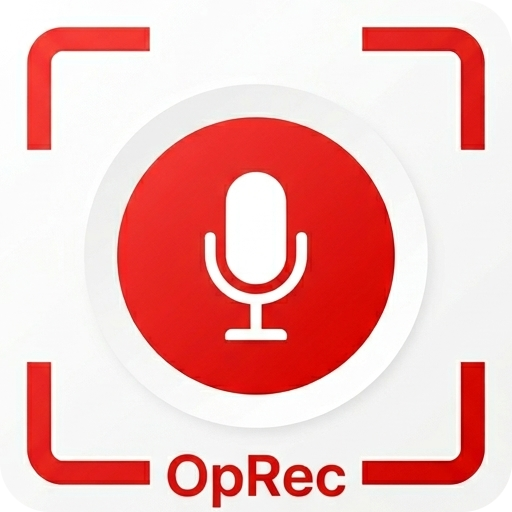

  

# OpRec

<!--  -->

)

OpRec は Windows 向けの画面録画アプリです。
ズーム、クリックハイライト、キー表示、システム/マイク音声録音などに対応しています。

## こんなときに便利

- 操作説明の動画を素早く作りたい
- クリック位置やキー入力を視覚的に見せたい
- 録画中に注目ポイントをズームで示したい

## 主な機能

本プロジェクト構造の詳細は[こちら](docs/architecture.md)。

- 任意範囲の画面録画
- システム/マイク音声の録音
- 設定の保存と管理 (詳細は[こちら](docs/settings.md))

### 録画用オーバーレイ機能

以下の機能は、録画対象となる録画用オーバーレイ画面で表示されます。

- マウスクリックのハイライト表示
- キー入力の表示
- ズーム表示

### ガイド用オーバーレイ機能

以下の機能は、録画対象とならないガイド用オーバーレイ画面で表示されます。

- ズーム位置を示す枠線及びミニマップ

## 必要環境

- Windows 10 Version 1903 (Build 18362) 以上
- Visual Studio 2022
- .NET 8 SDK

### NuGet

- CommunityToolkit.Mvvm
- CommunityToolkit.WinUI.Controls.SettingsControls
- Microsoft.Extensions.DependencyInjection
- Microsoft.Extensions.Hosting
- Microsoft.Extensions.Logging
- Microsoft.Graphics.Win2D
- Microsoft.Windows.SDK.BuildTools
- Microsoft.WindowsAppSDK
- NLog.Extensions.Logging
- NAudio
- WinUIEx

## ビルド & 実行

1. リポジトリをクローン
1. Visual Studio で `OpRec.slnx` を開く
1. `OpRec(Package)` でビルドして実行

## 操作説明

1. アプリを起動
1. 設定画面でホットキーや品質などを調整
1. 録画範囲をドラッグして選択
1. ホットキーまたは操作ボタンで録画開始/停止

### 操作イメージ

  

### 録画イメージ

  

## ライセンス

[MIT License](LICENSE.txt)
