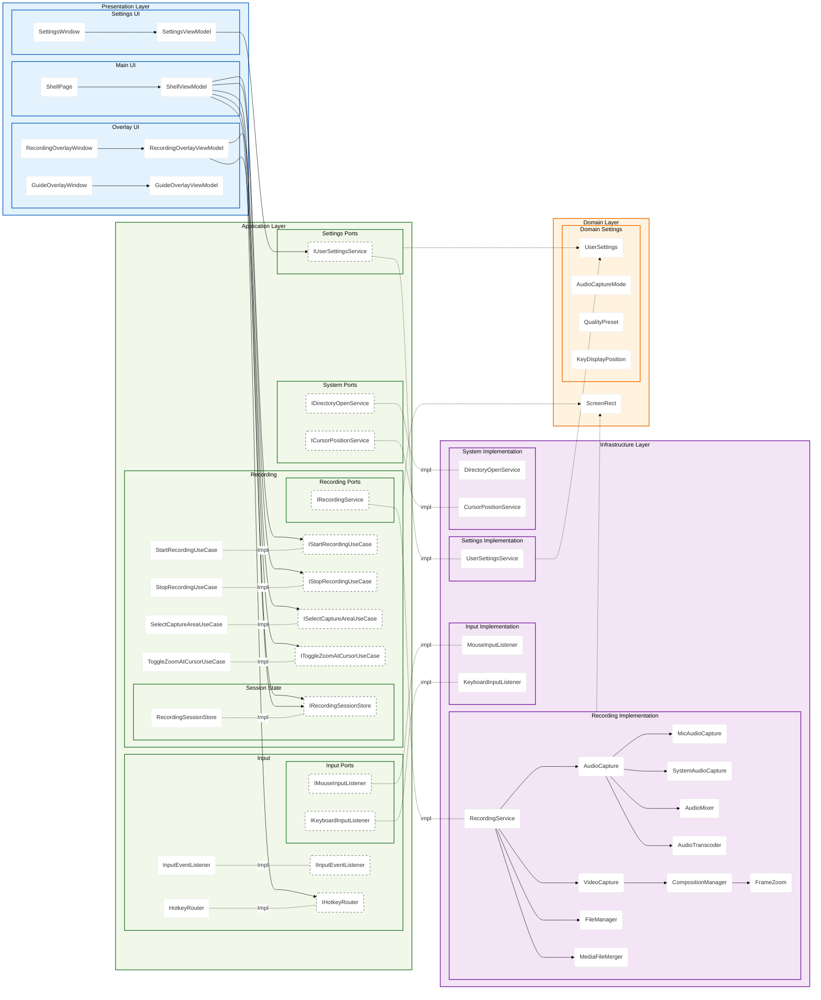

# Architecture

```mermaid
graph LR
    %%{init:{'theme':'base', 'themeVariables': { 'primaryColor': '#ffffff', 'edgeColor': '#555555' }}}%%

    classDef presentation fill:#e3f2fd,stroke:#1565c0,stroke-width:2px;
    classDef application fill:#f1f8e9,stroke:#2e7d32,stroke-width:2px;
    classDef infrastructure fill:#f3e5f5,stroke:#7b1fa2,stroke-width:2px;
    classDef domain fill:#fff3e0,stroke:#ef6c00,stroke-width:2px;
    classDef interface fill:#ffffff,stroke:#333333,stroke-dasharray: 5 5,color:#333333;

    subgraph Presentation ["Presentation Layer"]
        subgraph Presentation_Main ["Main UI"]
            ShellPage(ShellPage)
            ShellViewModel(ShellViewModel)
            ShellPage --> ShellViewModel
        end
        subgraph Presentation_Overlay ["Overlay UI"]
            RecordingOverlayWindow(RecordingOverlayWindow)
            RecordingOverlayViewModel(RecordingOverlayViewModel)
            GuideOverlayWindow(GuideOverlayWindow)
            GuideOverlayViewModel(GuideOverlayViewModel)
            RecordingOverlayWindow --> RecordingOverlayViewModel
            GuideOverlayWindow --> GuideOverlayViewModel
        end
        subgraph Presentation_Settings ["Settings UI"]
            SettingsWindow(SettingsWindow)
            SettingsViewModel(SettingsViewModel)
            SettingsWindow --> SettingsViewModel
        end
    end

    subgraph Application ["Application Layer"]
        subgraph Application_Recording ["Recording"]
            IStartRecordingUseCase(IStartRecordingUseCase)
            IStopRecordingUseCase(IStopRecordingUseCase)
            ISelectCaptureAreaUseCase(ISelectCaptureAreaUseCase)
            IToggleZoomAtCursorUseCase(IToggleZoomAtCursorUseCase)
            StartRecordingUseCase(StartRecordingUseCase)
            StopRecordingUseCase(StopRecordingUseCase)
            SelectCaptureAreaUseCase(SelectCaptureAreaUseCase)
            ToggleZoomAtCursorUseCase(ToggleZoomAtCursorUseCase)
            StartRecordingUseCase -.-|Impl| IStartRecordingUseCase
            StopRecordingUseCase -.-|Impl| IStopRecordingUseCase
            SelectCaptureAreaUseCase -.-|Impl| ISelectCaptureAreaUseCase
            ToggleZoomAtCursorUseCase -.-|Impl| IToggleZoomAtCursorUseCase
            subgraph Recording_Session ["Session State"]
                IRecordingSessionStore(IRecordingSessionStore)
                RecordingSessionStore(RecordingSessionStore)
                RecordingSessionStore -.-|Impl| IRecordingSessionStore
            end
            subgraph Recording_Ports ["Recording Ports"]
                IRecordingService(IRecordingService)
            end
        end

        subgraph Application_Input ["Input"]
            IInputEventListener(IInputEventListener)
            InputEventListener(InputEventListener)
            IHotkeyRouter(IHotkeyRouter)
            HotkeyRouter(HotkeyRouter)
            InputEventListener -.-|Impl| IInputEventListener
            HotkeyRouter -.-|Impl| IHotkeyRouter
            subgraph Input_Ports ["Input Ports"]
                IMouseInputListener(IMouseInputListener)
                IKeyboardInputListener(IKeyboardInputListener)
            end
        end

        subgraph Application_Settings ["Settings Ports"]
            IUserSettingsService(IUserSettingsService)
        end

        subgraph Application_System ["System Ports"]
            IDirectoryOpenService(IDirectoryOpenService)
            ICursorPositionService(ICursorPositionService)
        end
    end

    subgraph Infrastructure ["Infrastructure Layer"]
        subgraph Infrastructure_Recording ["Recording Implementation"]
            RecordingService(RecordingService)
            VideoCapture(VideoCapture)
            AudioCapture(AudioCapture)
            MicAudioCapture(MicAudioCapture)
            SystemAudioCapture(SystemAudioCapture)
            AudioMixer(AudioMixer)
            AudioTranscoder(AudioTranscoder)
            FileManager(FileManager)
            MediaFileMerger(MediaFileMerger)
            CompositionManager(CompositionManager)
            FrameZoom(FrameZoom)
            RecordingService --> VideoCapture
            RecordingService --> AudioCapture
            AudioCapture --> MicAudioCapture
            AudioCapture --> SystemAudioCapture
            AudioCapture --> AudioMixer
            AudioCapture --> AudioTranscoder
            RecordingService --> FileManager
            RecordingService --> MediaFileMerger
            VideoCapture --> CompositionManager
            CompositionManager --> FrameZoom
        end
        subgraph Infrastructure_Input ["Input Implementation"]
            MouseInputListener(MouseInputListener)
            KeyboardInputListener(KeyboardInputListener)
        end
        subgraph Infrastructure_Settings ["Settings Implementation"]
            UserSettingsService(UserSettingsService)
        end
        subgraph Infrastructure_System ["System Implementation"]
            DirectoryOpenService(DirectoryOpenService)
            CursorPositionService(CursorPositionService)
        end
    end

    subgraph Domain ["Domain Layer"]
        ScreenRect(ScreenRect)
        subgraph Domain_Settings ["Domain Settings"]
            UserSettings(UserSettings)
            AudioCaptureMode(AudioCaptureMode)
            QualityPreset(QualityPreset)
            KeyDisplayPosition(KeyDisplayPosition)
        end
    end

    %% Presentation to Application
    ShellViewModel --> IStartRecordingUseCase
    ShellViewModel --> IStopRecordingUseCase
    ShellViewModel --> IToggleZoomAtCursorUseCase
    ShellViewModel --> IHotkeyRouter
    ShellViewModel --> IRecordingSessionStore
    RecordingOverlayViewModel --> ISelectCaptureAreaUseCase
    RecordingOverlayViewModel --> IRecordingSessionStore
    SettingsViewModel --> IUserSettingsService

    %% Application to Infrastructure (Dependency Inversion / implementation)
    IRecordingService -.-|impl| RecordingService
    IMouseInputListener -.-|impl| MouseInputListener
    IKeyboardInputListener -.-|impl| KeyboardInputListener
    IUserSettingsService -.-|impl| UserSettingsService
    IDirectoryOpenService -.-|impl| DirectoryOpenService
    ICursorPositionService -.-|impl| CursorPositionService

    %% Application to Domain
    Application_Recording -.-> ScreenRect
    Application_Settings -.-> UserSettings

    %% Infrastructure to Domain
    Infrastructure_Recording -.-> ScreenRect
    Infrastructure_Settings -.-> UserSettings

    %% Apply Styles to Layers
    class Presentation,Presentation_Main,Presentation_Overlay,Presentation_Settings presentation
    class Application,Application_Recording,Application_Input,Application_Settings,Application_System,Recording_Session,Recording_Ports,Input_Ports application
    class Infrastructure,Infrastructure_Recording,Infrastructure_Input,Infrastructure_Settings,Infrastructure_System infrastructure
    class Domain,Domain_Settings domain

    %% Apply Styles to Interfaces
    class IStartRecordingUseCase,IStopRecordingUseCase,ISelectCaptureAreaUseCase,IToggleZoomAtCursorUseCase,IRecordingSessionStore,IRecordingService,IInputEventListener,IHotkeyRouter,IMouseInputListener,IKeyboardInputListener,IUserSettingsService,IDirectoryOpenService,ICursorPositionService interface
```
